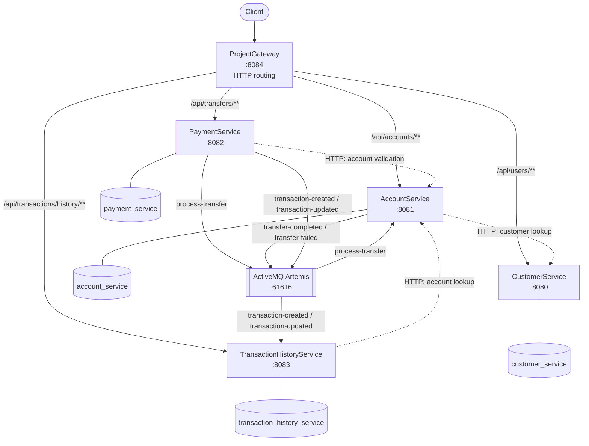

# LedgerFlow project guide

LedgerFlow is a Spring Boot microservices project for users, accounts, payments, and transaction history. Business services own their PostgreSQL databases; ActiveMQ Artemis handles asynchronous transfer events; `ProjectGateway` is the HTTP entry point.

> **Development/demo only:** no authentication or authorization exists. Do not expose this application publicly or use it for production financial data.

## Architecture



Solid arrows represent routes, databases, and queue messages. Dashed arrows represent synchronous HTTP calls.

## Project structure

```text
LedgerFlow/
├── CustomerService/              # Users; owns customer_service
├── AccountService/               # Accounts and balances; owns account_service
├── PaymentService/               # Transfer API/orchestration; owns payment_service
├── TransactionHistoryService/    # Transaction-history projection
├── ProjectGateway/               # Spring Cloud Gateway routes
└── .idea/runConfigurations/      # IntelliJ launch configurations
```

Each folder is an independent Maven project with a Maven Wrapper, `application.properties`, and Liquibase changelogs. There is no root Maven aggregator or Docker Compose file.

## Prerequisites

- JDK **26**
- PostgreSQL on `localhost:5432`
- Apache ActiveMQ Artemis on `localhost:61616`

Create the databases before startup:

```sql
CREATE DATABASE customer_service;
CREATE DATABASE account_service;
CREATE DATABASE payment_service;
CREATE DATABASE transaction_history_service;
```

Liquibase manages each service's tables when it starts.

## Environment variables

`application.properties` uses environment-variable placeholders. IntelliJ supplies them automatically through `.idea/runConfigurations/`; terminal, CI, Docker, and other launches must supply them too. Credentials are intentionally not printed here.

| Variable | Used by | Description |
|---|---|---|
| `SERVER_PORT` | All services | HTTP port; defaults to the service port below. |
| `DB_HOST`, `DB_PORT`, `DB_NAME` | All business services | PostgreSQL host, port, and service database. |
| `DB_USERNAME`, `DB_PASSWORD` | All business services | PostgreSQL credentials. |
| `ARTEMIS_HOST`, `ARTEMIS_PORT` | Account, Payment, History | Artemis broker host and port. |
| `ARTEMIS_USERNAME`, `ARTEMIS_PASSWORD` | Account, Payment, History | Artemis credentials. |
| `CUSTOMER_SERVICE_URL` | Account, Gateway | Customer service URL. |
| `ACCOUNT_SERVICE_URL` | Payment, History, Gateway | Account service URL. |
| `PAYMENT_SERVICE_URL` | Gateway | Payment service URL. |
| `TRANSACTION_SERVICE_URL` | Gateway | Transaction history service URL. |

The properties resolve connection values like this:

```properties
spring.datasource.url=jdbc:postgresql://${DB_HOST}:${DB_PORT}/${DB_NAME}
spring.artemis.broker-url=tcp://${ARTEMIS_HOST}:${ARTEMIS_PORT}
```

### Local service mapping

| IntelliJ configuration | Port | Database | Required service URL |
|---|---:|---|---|
| `CustomerServiceApplication` | 8080 | `customer_service` | — |
| `AccountServiceApplication` | 8081 | `account_service` | `CUSTOMER_SERVICE_URL=http://localhost:8080` |
| `PaymentServiceApplication` | 8082 | `payment_service` | `ACCOUNT_SERVICE_URL=http://localhost:8081` |
| `TransactionHistoryServiceApplication` | 8083 | `transaction_history_service` | `ACCOUNT_SERVICE_URL=http://localhost:8081` |
| `ProjectGatewayApplication` | 8084 | — | URLs for all four business services |

The IntelliJ configurations use local database and broker hosts (`localhost`), PostgreSQL port `5432`, and Artemis port `61616`.

## How to run

### IntelliJ IDEA

1. Start PostgreSQL and ActiveMQ Artemis.
2. Create the four databases.
3. Run these configurations in order:
   `CustomerServiceApplication`, `AccountServiceApplication`, `PaymentServiceApplication`, `TransactionHistoryServiceApplication`, then `ProjectGatewayApplication`.

The saved IntelliJ configurations provide all required variables.

### Terminal

Set the required variables before starting each service. For example, AccountService:

```bash
export SERVER_PORT=8081
export DB_HOST=localhost
export DB_PORT=5432
export DB_NAME=account_service
export DB_USERNAME=postgres
export DB_PASSWORD='your-postgres-password'
export ARTEMIS_HOST=localhost
export ARTEMIS_PORT=61616
export ARTEMIS_USERNAME=admin
export ARTEMIS_PASSWORD='your-artemis-password'
export CUSTOMER_SERVICE_URL=http://localhost:8080

cd AccountService && ./mvnw spring-boot:run
```

Start each remaining service in its own terminal, using the variables in the service mapping. Start the gateway last. Run a service's tests with `cd <ServiceDirectory> && ./mvnw test`.

## API overview

Use the gateway at `http://localhost:8084`; it strips `/api` before forwarding.

| Route | Capability |
|---|---|
| `/api/users/**` | Create, list, and retrieve users |
| `/api/accounts/**` | Create accounts, retrieve balances, deposit/withdraw, validate accounts |
| `/api/transfers/**` | Create transfers; retrieve status, details, and transfer history |
| `/api/transactions/history/**` | Retrieve a user's transaction history |

Create a transfer with a numeric idempotency header:

```bash
curl -X POST http://localhost:8084/api/transfers/ \
  -H 'Content-Type: application/json' \
  -H 'x-Idempotency-key: 123456' \
  -d '{"debtorAccountNumber":1001,"creditorAccountNumber":1002,"amount":25.0000}'
```

Springdoc Swagger UI is normally available at `/swagger-ui/index.html` on each business service port.

## Known limitations

- **No authentication or authorization:** no protected endpoints, JWT, or identity mechanism.
- **Possible data inconsistency:** failures, concurrency, retries, and partial message delivery can desynchronize services. There is no distributed transaction, saga/outbox, or reconciliation mechanism.
- **Design flaws remain:** service boundaries and the transfer workflow require architecture review.
- **Layer responsibilities are inconsistent:** constraints are handled in the database in some places and in business logic in others.
- **No centralized logging:** no log aggregation, correlation IDs, tracing, or shared observability solution.
- **Gateway is routing-only:** no rate limiting, authentication, authorization, or JWT validation.

## Production-readiness priorities

Add authentication/authorization, managed secrets, correct idempotent-response replay, resilient transactional messaging, consistent validation boundaries, gateway protection, and centralized structured logging with correlation IDs.
